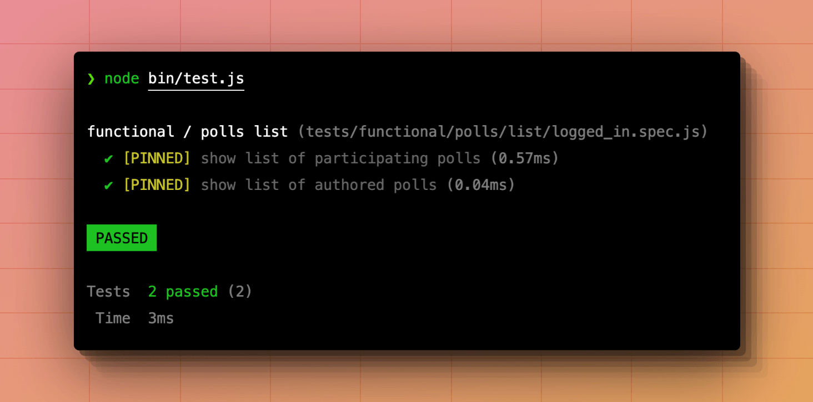

# Filtering tests

Japa offers several filtering layers to find and run an individual or group of tests. However, an excellent filtering experience starts with an organized test suite. Therefore, we will also discuss common ways to structure the tests properly.

## Using suites

Using test suites is the first step towards diving the tests by their nature. You should create a separate test suite for **unit tests**, **functional tests**, **browser tests**, and so on.

A great exercise is creating test suites with the resources they need. For example, Tests interacting with a headless browser should be kept inside a dedicated test suite so that Japa does not launch a browser when running unit tests.

Also, when you run tests for a specific suite, Japa will not import test files from other suites, which may result in faster execution time.

```sh
# Filter tests by suite

node bin/test.js unit

node bin/test.js functional

node bin/test.js browser
```

## Organize using folders

Instead of creating multiple test groups within a single file, you must create nested folders and files to organize your tests.

An example folder structure for organizing tests by `resource -> action -> scenario` follows.

- The `polls` folder contains all the tests for the `poll` resource.
- The `list` folder contains tests for the action/method that displays a list of polls.
- The `guest.spec.ts` file contains tests for the scenario when the viewer is a guest.
- The `logged_in.spec.ts` file contains tests for the scenario when the viewer is a logged-in user.

```
.
├── polls
│   └── list
│       ├── guest.spec.js
│       └── logged_in.spec.js
```

There can be cases in which an action does not have multiple scenarios, and therefore, you can write tests for that action within a top-level test file, as shown in the following example.

```
.
├── users
    └── register.spec.js
```

You can run tests from a specific file or folder as follows.

:::caption{for="info"}
**Run tests from any filename ending with "register"**
:::

```sh
node bin/test.js --files="register"
```

:::caption{for="info"}
**Run tests from any filename ending with "register" inside the users folder**
:::

```sh
node bin/test.js --files="users/register"
```

:::caption{for="info"}
**Run tests from all files within the polls directory**
:::

```sh
node bin/test.js --files="polls/*"
```

## Tagging tests

Tagging your tests is a great way to filter tests across multiple test suites and files. 

For example, you might have tests interacting with an external payment gateway spread across multiple files and folders, like **user registration**, **adding a payment method**, **making a purchase**, **issuing refund**, and so on.

Instead of applying multiple filters based on the filenames, you can tag these tests using the `test.tags` method and filter them by the tag name.

```ts
// title: payments/new_source.spec.js
test('add payment method', () => {
})
 .tags(['@payment_gateway'])
```

```ts
// title: checkout/logged_in/has_items.spec.js
test('charge user and create order', () => {
})
 .tags(['@payment_gateway'])
```

```ts
// title: orders/refund.spec.js
test('cancel order and issue refund', () => {
})
 .tags(['@payment_gateway'])
```

You can run tests with the `@payment_gateway` tag as follows.

```sh
node bin/test.js --tags="@payment_gateway"
```

You can ignore tests with the `@payment_gateway` tag by negating it with a tilde `~` symbol.

```sh
# Run all tests except the ones with @payment_gateway tag
node bin/test.js --tags="~@payment_gateway"
```

You can also specify multiple tags using the `--tags` filter.

```sh
node bin/test.js --tags="@payment_gateway,@slow"

node bin/test.js --tags="@payment_gateway" --tags="@slow"
```

When filtering for multiple tags, all the tests containing any mentioned tags will run. You must use the `--match-all` flag if you want to run tests that have all the mentioned tags.

```sh
node bin/test.js --tags="@payment_gateway,@slow" --match-all
```

## Filtering by group title

You can filter tests by the group title using the `--groups` filter. The filter accepts the exact title (a substring will not work).

```ts
import { test } from '@japa/runner'

test.group('polls list', () => {
  test('show list of public polls', () => {
  })
})
```

```sh
node bin/test.js --groups="polls list"
```

## Filtering by test title
You can filter tests by the test title using the `--tests` filter. The filter accepts the exact title (a substring will not work).

```ts
import { test } from '@japa/runner'

test.group('polls list', () => {
  test('show list of public polls', () => {
  })
})
```

```sh
node bin/test.js --tests="show list of public polls"
```

## Pinning tests

Pinning tests is helpful when you want to debug an individual or a group of tests for the time being. You can pin a test using the `test.pin` method, and Japa will only run the pinned tests.

```ts
import { test } from '@japa/runner'

test.group('polls list', () => {
  test('show list of public polls', () => {
    // implementation
  })

  test('show list of participating polls', () => {
    // implementation
  })
  .pin()

  test('show list of authored polls', () => {
    // implementation
  })
  .pin()
})
```

```sh
node bin/test.js
```



## Running failed tests

You can run failed tests using the `--failed` CLI flag. The CLI flag will execute tests that failed during the last run. It will run all the tests if there are no failing tests.

```sh
node bin/test.js --failed
```
