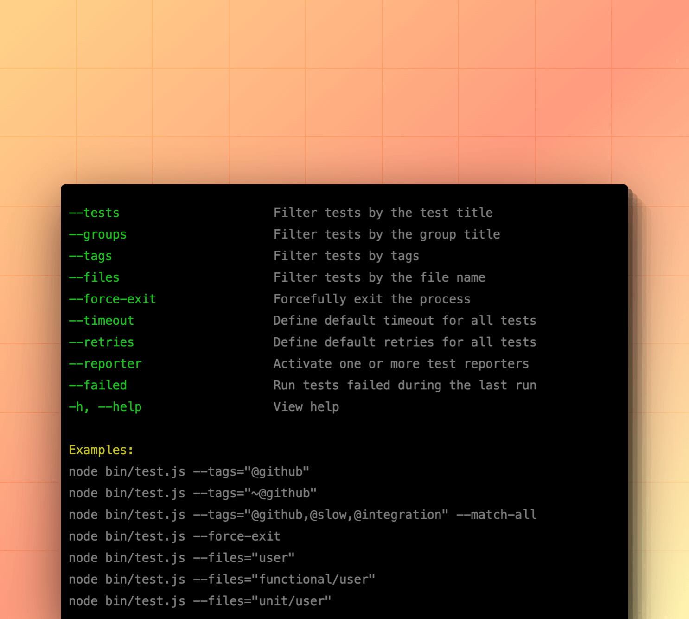
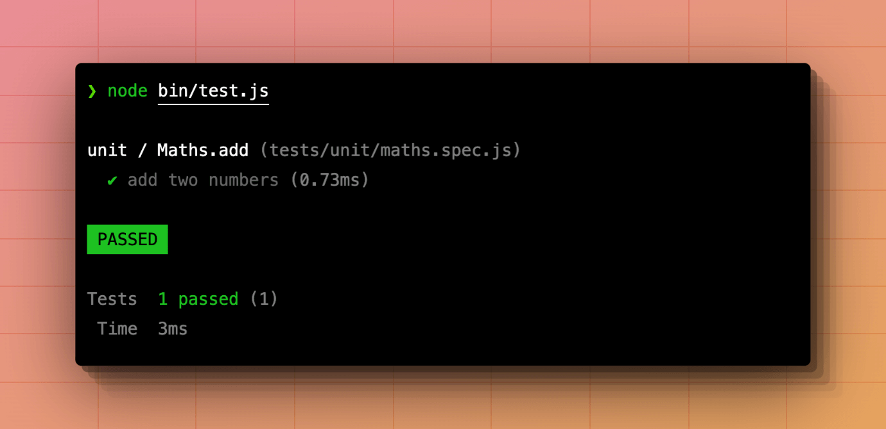

# Installation

:::warning

Japa requires `Node.js >= 18` and works only with the **ES module system**.

:::

You can configure Japa inside an existing Node.js project using the [`create-japa`](https://npm.im/create-japa) initializer package. The initializer package will perform the following actions.

- Install the `@japa/runner` package as a development dependency.
- Prompt you to select an assertion library.
- Prompt you to select and install additional plugins.
- Create `bin/test(.js|.ts)` entrypoint file. The entry point file is used to configure Japa and run tests.

:::codegroup

```sh
// title: npm
npm init japa@latest .
```

```sh
// title: yarn
yarn create japa@latest .
```

```sh
// title: pnpm
pnpm create japa@latest .
```

:::

## Configuring Japa
The entry point file `bin/test(.js|.ts)` is used to configure Japa and run tests. 

```ts
import { assert } from '@japa/assert'
import { apiClient } from '@japa/api-client'
import { expectTypeOf } from '@japa/expect-type'
import { configure, processCLIArgs, run } from '@japa/runner'

// highlight-start
processCLIArgs(process.argv.splice(2))
// highlight-end

// highlight-start
configure({
  files: ['tests/**/*.spec.js'],
  plugins: [
    assert(),
    expectTypeOf(),
  ],
})
// highlight-end

// highlight-start
run()
// highlight-end
```

<dl>

<dt>

processCLIArgs

</dt>

<dd>

The `processCLIArgs` method processes the command line arguments and tweaks the configuration based on the applied CLI flags.

</dd>

<dt>

configure

</dt>

<dd>

The `configure` method configures Japa by registering plugins, registering reporters, defining test files, and so on. [Read in-depth configuration guide](../reference/runner_config.md).

</dd>

<dt>

run

</dt>

<dd>

The `run` method should be called at the end to run tests based on the applied configuration. This method will take control of the Node.js process and exit it after executing all the tests.

</dd>

</dl>

## Writing your first test
As per the default configuration, the tests must be written inside the `tests` directory and each file must end with a `.spec.js` or `.spec.ts` file extension.

Let's create a new file and write our first test for demonstration.

```sh
mkdir tests
touch tests/example.spec.js
```

Tests are defined using the `test` method exported by the `@japa/runner` package. The method accepts the test title as the first argument and its implementation callback as the second argument.

The test callback function receives an instance of the [TestContext](../reference/test_context.md). In the following example, we destructure the `assert` property from the `TestContext` to write an assertion.

See also: [TestContext](../reference/test_context.md)

```ts
// title: tests/example.spec.js
import { test } from '@japa/runner'

function sum(a, b) {
  return a + b
}

test('add two numbers', ({ assert }) => {
  assert.equal(sum(2, 2), 4)
})
```

### Creating test groups
In the previous example, we have created a top-level test inside the `example.spec.js` file. You can wrap this test inside a group using the `test.group` method.

Test groups allows you define lifecycle hooks that runs before/after every test or all the tests. Also, you can filter and run tests of a group using the `--groups` flag.

See also: [Grouping tests](./grouping_tests.md)

```ts
import { test } from '@japa/runner'

function sum(a, b) {
  return a + b
}

// insert-start
test.group('Maths.add', () => {
// insert-end
  test('add two numbers', ({ assert }) => {
    assert.equal(sum(2, 2), 4)
  })
// insert-start
})
// insert-end
```

### Using test suites
Test suites allows you to organize tests by their type. For example, you can create a `unit` tests suite, and a `functional` tests suite. Each suite can have its own lifecycle hooks to run actions before/after all the tests.

The test suites are configured inside the entry point file using the `suites` property.

See also: [Test suites](./test_suites.md)

```ts
import { configure } from '@japa/runner'

configure({
  // delete-start
  files: ['tests/**/*.spec.js'],
  // delete-end
  // insert-start
  suites: [
    {
      name: 'unit',
      files: 'tests/unit/**/*.spec.js'
    },
    {
      name: 'functional',
      files: 'tests/functional/**/*.spec.js',
      configure(suite) {
        /**
         * Example showcasing how to start the HTTP
         * server before running tests from the
         * functional suite.
         */
        suite.setup(() => {
          const server = startHttpServer()
          return () => server.close()
        })
      }
    }
  ],
  // insert-end
  plugins: [
    assert(),
    expectTypeOf(),
  ],
})
```

## Running tests
You can run tests by executing the entry point file. Assuming you are writing tests inside a JavaScript project, you can run tests as follows.

```sh
node bin/test.js
```

The Japa entrypoint file acts as a mini CLI application and allows you to pass arguments and flags to configure the tests runner. You can view the available options using the `--help` flag.

```sh
node bin/test.js --help
```



You can run tests for a specific test suite by defining the suite name as the first argument.

```sh
node bin/test.js unit
node bin/test.js functional

# Run from both unit and functional
node bin/test.js functional unit
```

### Tests output
Japa uses reporters to display the progress and the final summary of tests. By default, the `spec` reporter is used to output a detailed summary to the command-line, which looks similar to the following screenshot.

See also: [Test reporters](./test_reporters.md)



## Writing assertions
You can use one of the following Japa plugins to write assertions within your tests. 

- [assert](../plugins/assert.md): The `assert` plugin uses Chai.js assertion module under the hood.
- [expect](../plugins/expect.md): The `expect` plugin is a thin wrapper on top of Jest expect library.
- [expectTypeOf](../plugins/expect_type.md): The `expectTypeOf` plugin allows you to write assertions for TypeScript types.

```ts
// title: With Chai assert
test('add two numbers', ({ assert }) => {
  assert.equal(2 + 2, 4)
})
```

```ts
// title: With Jest expect
test('add two numbers', ({ expect }) => {
  expect(2 + 2).toEqual(4)
})
```

```ts
// title: Asserting Types
test('find user by id', async ({ expectTypeOf }) => {
  const user = await User.find(1)
  expectTypeOf(user).toMatchTypeOf<User | null>()
})
```

## VSCode extension
If you are using VSCode, you can install the [official extension](https://marketplace.visualstudio.com/items?itemName=jripouteau.japa-vscode) to run tests directly from your code editor.

