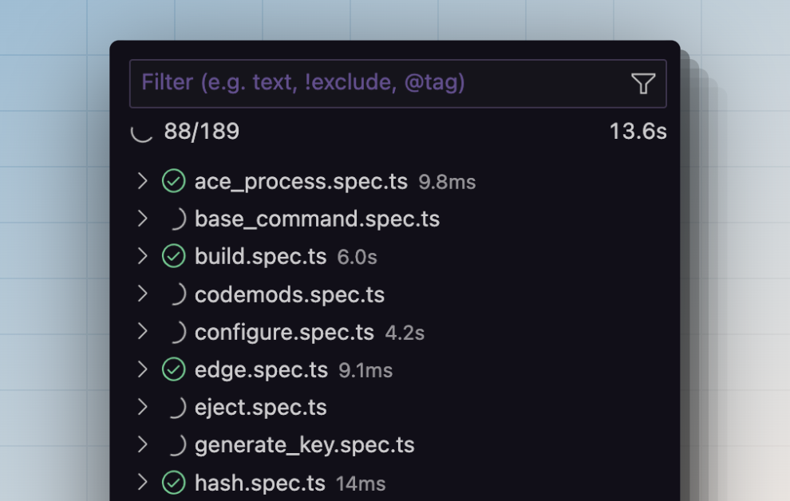

# A simple yet powerful testing framework for Node.js

Japa comes with everything you need to test your backend applications. Be it writing JSON API tests using an Open API schema or writing browser tests using Playwright.

Unlike other testing frameworks born out of the frontend ecosystem, Japa focuses only on testing backend applications and libraries. Therefore, Japa is **simpler**, **faster**, and **bloatware free**.

:::note

Japa installation size is **9 times smaller than Vitest and 5 times smaller than Jest**. 

While smaller bundle size should not be a factor for choosing a framework, it does indicate the frontend first test runners bundles dependencies that are not relevant when developing strictly for Node.js.

:::


## No overhead of transpiling source code
Popular testing frameworks like Jest (uses Babel) and Vitest (uses Vite) use transpilers to process your source code. No matter how quick the underlying transpilers are, they will always have additional overhead compared to tools with no transpilers.

If you are building libraries or applications to work with Node.js runtime (not the browser), there is no need to use a transpiler. As a result:

- You will have a better debugging experience.
- Your application and tests will boot faster.
- No additional configuration to manage.

## Works with your existing project setup
Since Japa does not have to use transpilers, it works with your existing project setup. Moreover, Japa does not even have a CLI tool. You run your tests using the `node` or `bun` command.

- **Got an ESM project?** - Install Japa, create an entry point file, and you are good to go.
- **Got a TypeScript project?** - Install Japa, create an entry point file, and use your existing TypeScript tooling like [`ts-node`](https://typestrong.org/ts-node/) or [`tsx`](https://github.com/esbuild-kit/tsx) to run tests.

```sh
# Node.js
node bin/tests.js

# Bun
bun bin/tests.js

# TypeScript and TS Node
node --loader=ts-node/esm bin/tests.js

# TypeScript with TSX
npx tsx bin/tests.js
```

## What else does Japa have to offer?
Japa ticks almost every checkbox to provide a **great testing experience**, ships with a ton of **officially maintained plugins** and a **VSCode extension** to view and run tests directly from your code editor.

<div class="feature_highlight">

<div class="feature_highlight_bullet_points">

- Support for asynchronous tests.
- Support for snapshot testing.
- Official plugins for chai assert and jest expect assertion libraries.
- Coverage reporting using nyc and c8.
- Ability to pin and run only selected tests.
- Organize tests inside multiple test suites and groups.

</div>

::include{template="partials/features/basics_covered"}

</div>

<div class="feature_highlight">

<div class="feature_highlight_bullet_points">

- Register an Open API schema.
- Make an HTTP request to your API server.
- Assert the response body, headers, and status code matches the schema structure.

</div>

::include{template="partials/features/api_testing"}

</div>

<div class="feature_highlight">

<div class="feature_highlight_bullet_points">

- Automatic management of browser and browser context.
- Class-based pages and interactions to de-compose tests into small testable units.
- Web first assertions.
- Control headless mode, debugging, and enable tracing using command-line flags.

</div>

::include{template="partials/features/browser_testing"}

</div>

<div class="feature_highlight">

<div>

```ts
test('validate email')
 .with([
    'some+user@gmail.com',
    'some.user@gmail.com',
    'email@123.123.123.123'
  ])
  .run(({ assert }, email) => {
    assert.isTrue(validateEmail(email))
  })
```

</div>

::include{template="partials/features/datasets"}

</div>

<div class="feature_highlight">

<div class="feature_highlight_image" markdown="1">



</div>

::include{template="partials/features/vscode_extension"}

</div>

## Sponsors

::include{template="partials/sponsors"}
