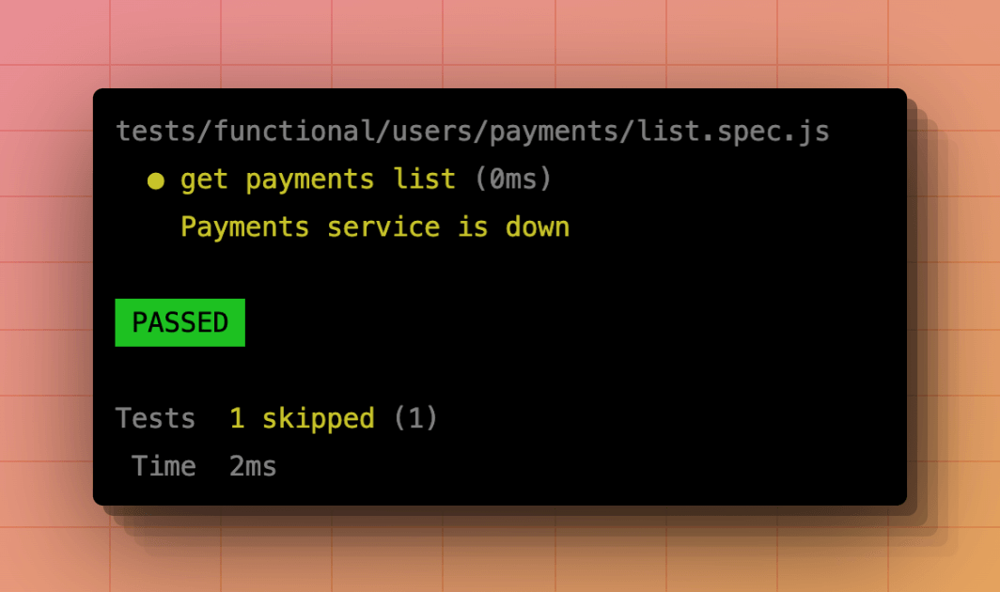
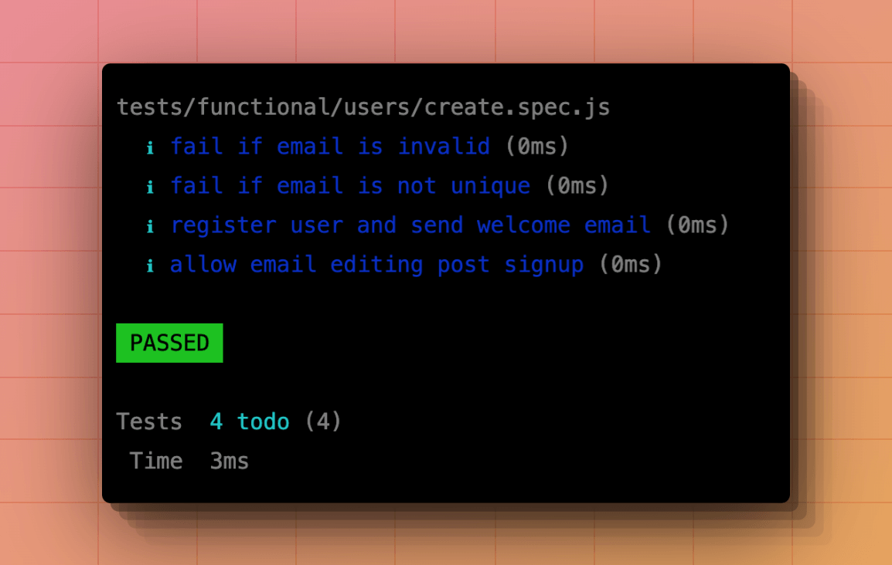

# Skipping tests

Sometimes, you might run into situations where you want to skip specific tests temporarily, so instead of commenting out the code, you may use the `test.skip` method to prevent specific tests from running.

The `test.skip` method accepts a boolean as the first parameter and skips the test if the value is `true`. Optionally, you can define the reason for skipping the test as the second parameter.

```ts
import { test } from '@japa/runner'

test('get payments list', async () => {
})
 .skip(true, 'Payments service is down')
``` 

You can also skip tests conditionally. For example, not running specific tests in the CI environment.

```ts
import { test } from '@japa/runner'

const isInCI = !!process.env.CI

test('add two numbers', () => {
})
  .skip(isInCI)
```

Finally, you may pass a function as the first parameter to lazily evaluate whether or not to skip the test. 

```ts
import { test } from '@japa/runner'

test('get payments list', async () => {
})
 .skip(async () => {
   const pingStatus = await pingPaymentsService()
   return pingStatus === 'down' ? true : false
 })
```

Skipped tests are marked yellow in the `spec` reporter output.



## Creating todos

Todos allows you to create placeholder tests without any implementation. You can use todos to list the scenarios you want to test before writing the implementation.

You may create a test without the callback, which will automatically be marked as `todo`.

```ts
import { test } from '@japa/runner'

test('fail if email is invalid')

test('fail if email is not unique')

test('register user and send welcome email')

test('allow email editing post signup')
```

